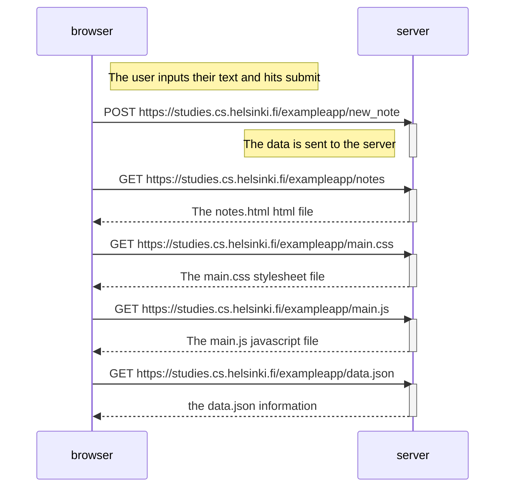

```mermaid
sequenceDiagram;
      participant browser
      participant server

      Note right of browser: The user inputs their text and hits submit
      browser->>server: POST https://studies.cs.helsinki.fi/exampleapp/new_note
      activate server
      Note left of server: The data is sent to the server
      deactivate server 

      browser->>server: GET https://studies.cs.helsinki.fi/exampleapp/notes
      activate server
      server-->>browser: The notes.html html file
      deactivate server

      browser->>server: GET https://studies.cs.helsinki.fi/exampleapp/main.css
      activate server
      server-->>browser: The main.css stylesheet file
      deactivate server

      browser->>server: GET https://studies.cs.helsinki.fi/exampleapp/main.js
      activate server
      server-->>browser: The main.js javascript file
      deactivate server

      browser->>server: GET https://studies.cs.helsinki.fi/exampleapp/data.json
      activate server
      server-->>browser: the data.json information
      deactivate server
```
